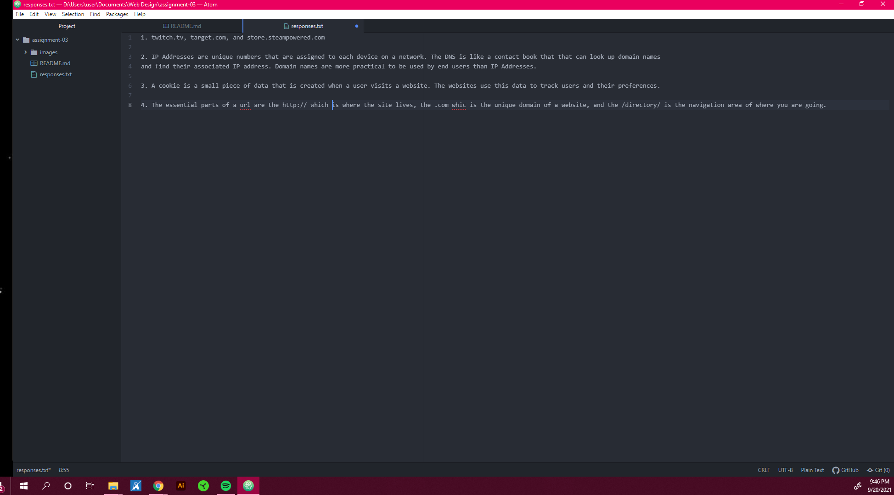

# Assignment 3
## Avianna Soto
1. I learned about the internet protocol and the relationship between IP addresses and the DNS
2. I learned about the anatomy of a URL and the purpose of each part of a url
3. I learned about markup language and its different elements

[Twitch](twitch.tv)

[Responses](./responses.txt)

