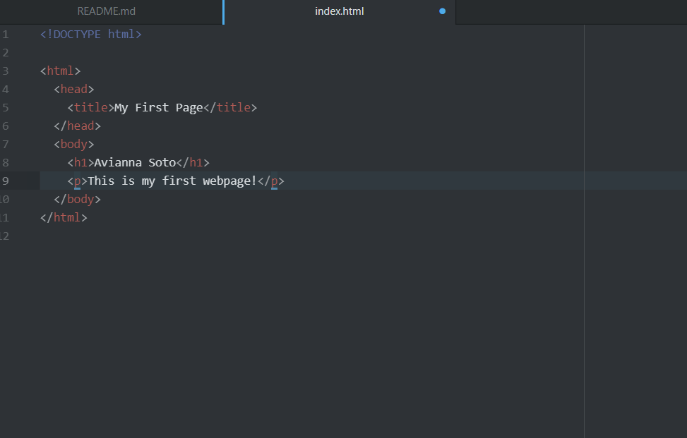

1. Browsers function by sending requests to web servers then rendering web pages for users to interact with. I mainly use Chrome.
2. A Markup language controls a page's architecture. A common one is Extensible Markup language or XML which describes document nodes.
3. 
