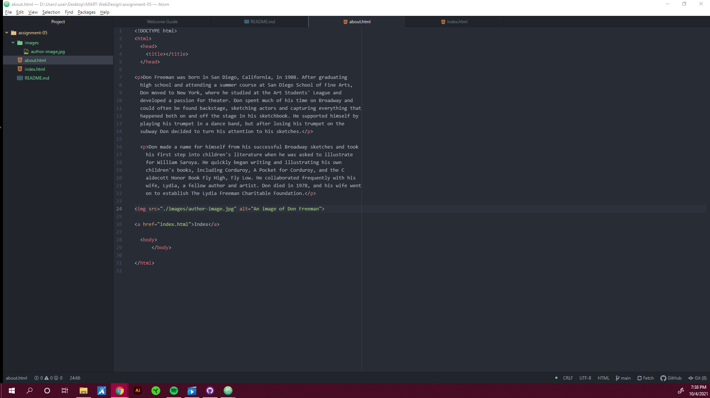

1. For The Wayback Machine, I visited Twitch. Since that is a sight I visit almost daily, it was so strange to see how drastically different it was even just a few years ago. I would say the biggest change I noticed was the different background options for users streams. On Twitch now, everyone's background is either just a white or black screen instead of a custom image or color.
2. Since I haven't taken a Web Design class since highschool, everything in these last few topics have been a great refresher to some of the baseline things I know how to do. I haven't found it to be difficult since we have access to so many great resources.
3. 
